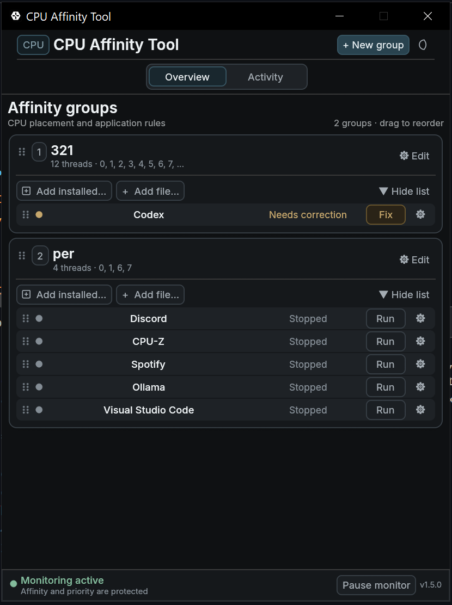

# CPU Affinity Tool

**Split games and background apps across different CPU core groups on Windows.**

CPU Affinity Tool helps you decide which CPU cores your programs can use. This is called **CPU affinity**: instead of letting every app fight for the same CPU time, you choose where each app should run.

This is especially useful on modern CPUs with different kinds of cores or multiple chiplets. You can keep a game on one group of cores and move browsers, Discord, launchers, overlays, or other background apps to another.

[Download the latest release](https://github.com/middaysan/cpu-affinity-tool/releases/latest) | [Browse all releases](https://github.com/middaysan/cpu-affinity-tool/releases)

## Why this tool exists

When a game and your background apps use the same CPU resources, they can get in each other's way. That can show up as stutter, uneven frame times, or sudden dips when your CPU is the bottleneck.

Modern processors make this more noticeable:

- some CPUs have different types of cores
- some CPUs split cores across multiple chiplets or CCDs
- some systems simply feel better when foreground work and background work stay apart

CPU Affinity Tool gives you a simple way to make that split yourself.

## Best for

- PCs with hybrid CPUs, such as performance and efficiency cores
- multi-chiplet or multi-CCD CPUs
- games that are limited by the CPU more than the GPU
- setups where a game runs alongside browsers, Discord, launchers, recording tools, or work apps

## What it helps with

- Keep a game on one group of cores and background apps on another
- Reduce CPU contention between the app you care about and everything else
- Launch apps with saved core and priority rules
- Re-apply settings automatically if a program changes them while running
- Keep separate layouts for gaming, work, streaming, or everyday use

## What to expect

This is **not** a magic FPS button. Some PCs and games will show little difference, and results depend on your CPU, the game, and what is running in the background.

The main benefit is better control over where CPU time goes. In CPU-limited situations, that can mean:

- fewer sudden dips
- smoother frame-time behavior
- more consistent performance when background apps are active

## Quick start

1. Create a core group for the apps you want to isolate, such as `Game Cores` or `Background Cores`.
2. Add apps to that group with **Open App**, **Find Installed**, or drag and drop.
3. Launch the app from the tool and keep monitoring enabled if you want settings to be restored automatically while it runs.

## Features

- **Core groups**: Save groups of CPU cores for different tasks
- **App launch rules**: Start apps with a chosen core group and process priority
- **Open App**: Add normal `.exe`, `.lnk`, or `.url` targets from disk
- **Find Installed**: Add supported installed Windows apps from the Start-based app list
- **Automatic monitoring**: Re-apply affinity and priority if an app changes them
- **Autorun**: Start selected apps automatically with the tool
- **Drag and drop**: Drop an app or shortcut into the window to add it quickly
- **Logs**: See launch and setting events in the built-in history view
- **Themes**: Light, dark, or system theme

## Typical examples

- **Gaming layout**: Put the game on one core group and move the browser, Discord, launchers, and update tools to another
- **Work layout**: Keep a heavy work app on one group and leave the rest of the system on another
- **Streaming or recording layout**: Separate the game from background tools that would otherwise compete for CPU time
- **Multi-chiplet setup**: Keep the main app on one chiplet or CCD and background load on another

## Requirements and limitations

- Windows is the only supported and published platform today
- Current releases publish `cpu-affinity-tool.exe`
- The app requires administrator rights, so Windows will normally show a UAC prompt on launch
- The repository also contains a Linux entrypoint, but that path is still experimental and is not part of the supported release
- If an installed Windows app is not listed in **Find Installed**, use **Open App** instead

For release-process details, see [docs/release-checklist.md](docs/release-checklist.md).

## Download

- [Latest Windows release](https://github.com/middaysan/cpu-affinity-tool/releases/latest)
- [All releases](https://github.com/middaysan/cpu-affinity-tool/releases)

## License

This project is licensed for non-commercial use. You may use it for free for personal purposes. For commercial use, please contact the author.
