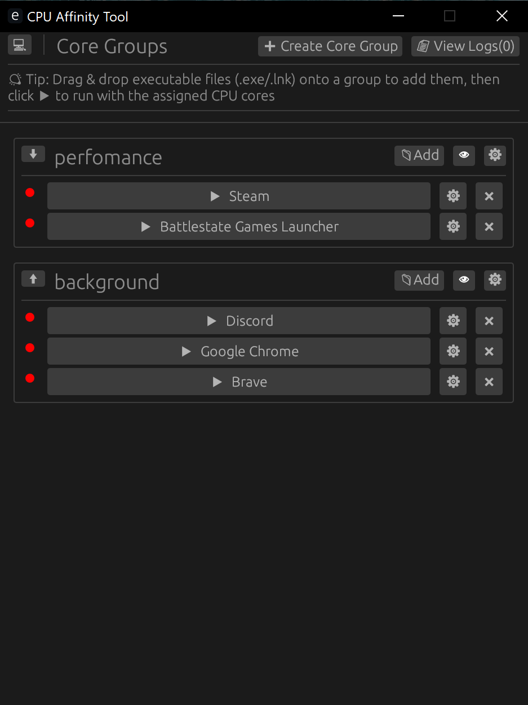

# CPU Affinity Tool

A simple and convenient program for managing CPU cores (CPU affinity) on Windows. It allows you to manually choose which cores your applications will run on, helping to improve performance, optimize resource distribution, and make the system more responsive.

## Why do you need this?

- **Improve Performance**: Isolate resource-heavy programs on separate cores.
- **Gaming Stability**: Dedicate specific cores to games to avoid micro-stutters caused by background tasks.
- **System Smoothness**: Assign background processes to some cores and important work tools to others.
- **Flexible Tuning**: Experiment with load distribution to achieve maximum efficiency.

## Key Features

- **Core Groups**: Create sets of cores (e.g., "Gaming Cores", "Background Cores") and easily switch between them.
- **App Management**: Launch programs tied to specific cores with the desired priority.
- **Automatic Monitoring**: The program tracks running processes and automatically restores core and priority settings if an app changes them.
- **Autorun**: Configure programs to start automatically together with the tool.
- **Drag & Drop**: Simply drag an `.exe` file or a shortcut into the program window to add it to a group.
- **Themes**: Choose between Light, Dark, or System themes.
- **Event History (Logs)**: View the history of launches and applied settings.

## How to Use

### 1. Creating a Core Group
Click the **"+ Create Group"** button at the top of the window. Enter a group name (e.g., "Work") and select the cores you want to include. Click "Save".

### 2. Adding Applications
Select the desired group from the list. You can add an application in two ways:
- Click the **"+ Add App"** button and select the executable file.
- Simply drag the application file (`.exe`) or its shortcut directly onto the group area in the program window.

### 3. App Settings
Click the gear icon (**⚙**) next to the application name to:
- Change the process priority (e.g., set to "High" for games).
- Add command-line arguments.
- Enable **Autorun** so the app starts automatically when CPU Affinity Tool is launched.

### 4. Launching
- Click the blue button with the application name to launch it.
- If the app is already running, the program will simply switch focus to its window.
- If the **"Run All"** button is enabled in the group settings, you can launch all apps in the group with a single click.

### 5. Process Monitoring
At the bottom of the window (footer), there is a monitoring toggle button. 
- When it is **ACTIVE**, the program will automatically ensure that apps do not "reset" their core and priority settings. 
- This is useful for games and programs that tend to change their own parameters while running.

## License

This project is licensed for non-commercial use. You may use it for free for personal purposes. For commercial use, please contact the author.